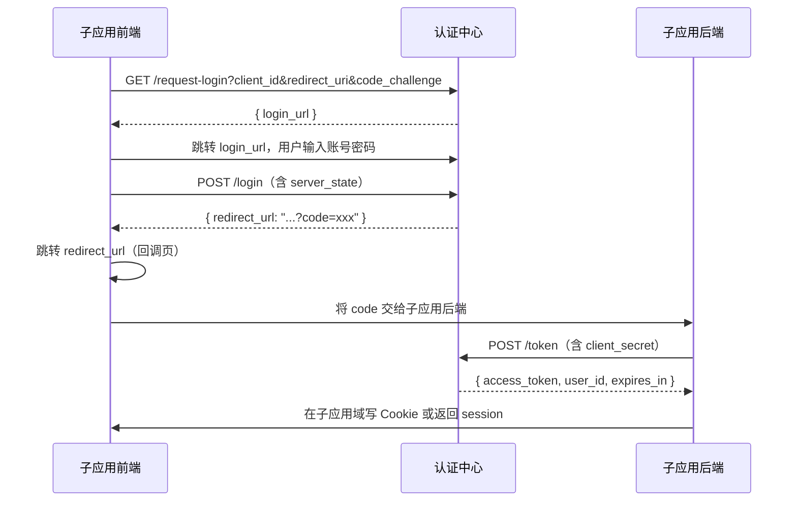

# Monai Auth 对接文档

本文档说明外部应用如何对接 **Monai Auth** 认证中心，分为**前端**与**服务端**两部分。完整接口字段与错误码见 [API 文档](./apis/api.md)。

---

## 1. 服务概览

Monai Auth 是一个独立的认证中心，提供：

| 能力 | 说明 |
| ---- | ---- |
| 邮箱密码登录 / 注册 | 本地账号体系 |
| 双 Token 会话 | Access Token（JWT）+ Refresh Token（数据库存储、可吊销） |
| SSO 授权码流程 | 跨域子应用单点登录，支持 PKCE |
| Token 校验 | 供其他服务验证用户身份 |
| 静态资源上传 | 登录用户上传文件至 `uploads/<用户名>/` |

**默认地址**：`http://localhost:8888`（以 `configs/config.yaml` 中 `server.port` 及反向代理配置为准）

**鉴权方式**（二选一，服务端均支持）：

- **Cookie**（浏览器推荐）：`auth_token`（Access Token）、`refresh_token`（仅刷新接口携带）
- **Authorization 头**（服务端 / 移动端推荐）：`Authorization: Bearer <access_token>`

---

## 2. 对接前准备

### 2.1 在认证中心注册子应用（SSO 场景必填）

在 `configs/config.yaml` 的 `server.clients` 中登记子应用：

```yaml
server:
  port: "8888"
  jwt_secret: "your-strong-secret"
  jwt_expiration_hours: 2
  refresh_token_expiry_days: 7
  auth_base_url: "https://auth.example.com"   # 对外访问地址，用于拼登录页 URL
  login_page_path: "/auth"                    # 认证中心登录页路径
  allowed_origins:
    - "https://app.example.com"               # 子应用前端域名（CORS + credentials）
  clients:
    - client_id: "my-app"
      client_secret: "only-for-backend"         # 仅子应用服务端持有，禁止暴露给浏览器
      allowed_redirect_uris:
        - "https://app.example.com"            # 仅校验 scheme+host，路径不参与白名单
```

### 2.2 跨域与 Cookie

浏览器跨域调用认证接口时：

1. 将子应用前端 Origin 加入 `server.allowed_origins`
2. 前端请求必须带 `credentials: 'include'`（或 axios 的 `withCredentials: true`）
3. Cookie 为 `HttpOnly; Secure; SameSite=Lax`，生产环境需 HTTPS

本地开发若 Cookie 的 `Secure` 导致 HTTP 下无法写入，需通过 HTTPS 或同源代理解决。

### 2.3 选择对接模式

```
┌─────────────────────────────────────────────────────────────────┐
│                        你的应用需要什么？                         │
└─────────────────────────────────────────────────────────────────┘
         │
         ├─ 与认证中心同源（或 Nginx 反代到同域）
         │     → 前端直连：登录 / 刷新 / 登出，Cookie 自动携带
         │
         └─ 跨域子应用（SSO）
               ├─ 有子应用后端（推荐）
               │     → 前端走授权码；后端用 client_secret 换 token
               └─ 纯前端 SPA
                     → 前端 PKCE + token-by-code（无需 client_secret）
```

---

## 3. 前端对接

### 3.1 模式 A：同源直接登录（非 SSO）

适用于前端与认证中心同域，或经网关将 `/api/v1/auth/*` 反代到认证服务。

**流程**：

1. `POST /api/v1/auth/register` 注册（可选）
2. `POST /api/v1/auth/login` 登录 → 响应 `{"status":"ok"}`，浏览器自动写入 `auth_token`、`refresh_token` Cookie
3. 后续请求带 Cookie 访问受保护接口（如 `GET /api/v1/auth/me`）
4. 收到 `401` 时调用 `POST /api/v1/auth/refresh` 无感续期
5. `POST /api/v1/auth/logout` 登出

**登录示例（fetch）**：

```javascript
await fetch("/api/v1/auth/login", {
  method: "POST",
  headers: { "Content-Type": "application/json" },
  credentials: "include",
  body: JSON.stringify({
    email: "user@example.com",
    password: "password123",
  }),
});
```

**401 无感刷新（axios 拦截器）**：

```javascript
import axios from "axios";

const api = axios.create({ withCredentials: true });

api.interceptors.response.use(null, async (error) => {
  const config = error.config;
  if (error.response?.status === 401 && !config._retry) {
    config._retry = true;
    try {
      await axios.post("/api/v1/auth/refresh", {}, { withCredentials: true });
      return api(config);
    } catch {
      window.location.href = "/login";
    }
  }
  return Promise.reject(error);
});
```

**前端常用接口**：

| 方法 | 路径 | 说明 |
| ---- | ---- | ---- |
| POST | `/api/v1/auth/register` | 注册 |
| POST | `/api/v1/auth/login` | 登录，写 Cookie |
| POST | `/api/v1/auth/logout` | 登出，吊销 refresh_token |
| POST | `/api/v1/auth/refresh` | 刷新 Access Token（Token 轮换） |
| GET | `/api/v1/auth/me` | 当前用户信息 |
| POST | `/api/v1/auth/upload` | 上传文件（multipart） |

---

### 3.2 模式 B：SSO + 子应用后端（推荐）

适用于子应用有独立后端，可安全保存 `client_secret`。

**完整流程**：



**步骤说明**：

#### 步骤 1：生成 PKCE 并请求登录页

```javascript
// 生成 code_verifier（43–128 字符随机串，需本地保存）
function randomString(len = 64) {
  const chars = "ABCDEFGHIJKLMNOPQRSTUVWXYZabcdefghijklmnopqrstuvwxyz0123456789-._~";
  return Array.from(crypto.getRandomValues(new Uint8Array(len)))
    .map((b) => chars[b % chars.length])
    .join("");
}

async function sha256Base64Url(input) {
  const data = new TextEncoder().encode(input);
  const hash = await crypto.subtle.digest("SHA-256", data);
  return btoa(String.fromCharCode(...new Uint8Array(hash)))
    .replace(/\+/g, "-")
    .replace(/\//g, "_")
    .replace(/=+$/, "");
}

const codeVerifier = randomString();
sessionStorage.setItem("pkce_verifier", codeVerifier);
const codeChallenge = await sha256Base64Url(codeVerifier);

const params = new URLSearchParams({
  client_id: "my-app",
  redirect_uri: "https://app.example.com/callback",
  code_challenge: codeChallenge,
  code_challenge_method: "S256",
});

const res = await fetch(
  `https://auth.example.com/api/v1/auth/request-login?${params}`,
  { credentials: "include" }
);
const { login_url } = await res.json();
window.location.href = login_url;
```

#### 步骤 2：认证中心登录页提交

登录页 URL 中含 `state` 参数。用户提交账号密码时，请求体需包含：

```json
{
  "email": "user@example.com",
  "password": "password123",
  "server_state": "<URL 中的 state 参数>"
}
```

成功后返回：

```json
{ "redirect_url": "https://app.example.com/callback?code=一次性授权码" }
```

前端根据 `redirect_url` 跳转至子应用回调页。

#### 步骤 3：回调页将 code 交给子应用后端

```javascript
// 子应用 /callback 页面
const code = new URLSearchParams(location.search).get("code");
await fetch("/api/auth/callback", {
  method: "POST",
  headers: { "Content-Type": "application/json" },
  credentials: "include",
  body: JSON.stringify({ code }),
});
```

**前端不要**直接调用 `POST /api/v1/auth/token`，`client_secret` 只能出现在子应用服务端。

---

### 3.3 模式 C：SSO 纯前端（无子应用后端）

无后端时，前端在步骤 1 保存 `code_verifier`，回调后直连认证中心换 Token。

**回调页逻辑**：

```javascript
const code = new URLSearchParams(location.search).get("code");
const codeVerifier = sessionStorage.getItem("pkce_verifier");

await fetch("https://auth.example.com/api/v1/auth/token-by-code", {
  method: "POST",
  headers: { "Content-Type": "application/json" },
  credentials: "include",
  body: JSON.stringify({
    client_id: "my-app",
    code,
    redirect_uri: "https://app.example.com/callback",
    code_verifier: codeVerifier,
  }),
});
// 成功：认证中心域写入 auth_token、refresh_token Cookie
// 可再调 GET /api/v1/auth/me 获取用户信息
```

**注意**：

- Cookie 落在**认证中心域名**下；子应用与认证中心跨域时，子应用无法直接读取这些 Cookie
- 若子应用需独立会话，应优先采用模式 B，由子应用后端签发自己的 session
- 若前后端均与认证中心同源（反代），模式 C 可与模式 A 的刷新逻辑复用

---

### 3.4 Cookie 说明（前端必读）

| Cookie | 路径 | 有效期（默认） | 用途 |
| ------ | ---- | -------------- | ---- |
| `auth_token` | `/` | 2 小时 | 业务请求鉴权 |
| `refresh_token` | `/api/v1/auth/refresh` | 7 天 | 仅刷新接口自动携带 |

`refresh_token` 路径受限，其他 API 请求不会带上，降低泄露风险。刷新成功后会**轮换** refresh_token，旧值立即失效。

---

### 3.5 前端错误处理

统一错误体：

```json
{ "code": "INVALID_CREDENTIALS", "message": "Invalid credentials" }
```

常见场景：

| code | 处理建议 |
| ---- | -------- |
| `INVALID_CREDENTIALS` | 提示账号或密码错误 |
| `UNAUTHORIZED` / `INVALID_TOKEN` | 尝试 refresh；失败则跳转登录 |
| `INVALID_GRANT` | SSO code 过期或 PKCE 不匹配，重新发起登录 |
| `TOO_MANY_REQUESTS` | 限速（登录类 100 次/15 分钟），稍后重试 |

---

## 4. 服务端对接

### 4.1 校验用户 Token

其他微服务需确认请求方身份时，有两种方式。

#### 方式 1：调用认证中心（简单，有网络开销）

```http
GET /api/v1/auth/validate
Authorization: Bearer <access_token>
```

成功响应：

```json
{ "id": 123, "email": "user@example.com" }
```

适合：语言栈不统一、不想共享 JWT 密钥、仅需少量校验。

#### 方式 2：本地校验 JWT（高性能）

JWT 使用 **HS256**，Payload 含 `user_id`：

```go
// Claims 结构（与 internal/auth/token.go 一致）
type Claims struct {
    UserID int64 `json:"user_id"`
    // 标准字段：exp, iat
}
```

子应用服务端需与认证中心配置**相同的** `server.jwt_secret`，自行解析并校验 `exp`。

适合：高频 API 网关、Go/Java 等同构服务集群。

---

### 4.2 SSO：用授权码换取 Token（子应用后端）

**接口**：`POST /api/v1/auth/token`

**必须由子应用服务端调用**，禁止浏览器直连。

```bash
curl -X POST "https://auth.example.com/api/v1/auth/token" \
  -H "Content-Type: application/json" \
  -d '{
    "grant_type": "authorization_code",
    "code": "前端回调带来的授权码",
    "client_id": "my-app",
    "client_secret": "only-for-backend",
    "redirect_uri": "https://app.example.com/callback"
  }'
```

成功响应：

```json
{
  "access_token": "eyJhbGciOiJIUzI1NiIs...",
  "token_type": "Bearer",
  "expires_in": 7200,
  "user_id": 123
}
```

**子应用后端收到 token 后的常见做法**：

1. 在**子应用域名**下设置自己的 session Cookie（推荐，与认证中心解耦）
2. 将 `access_token` 存入服务端 session，前端只持有 session id
3. 网关层转发时附加 `Authorization: Bearer <access_token>` 访问下游服务

**不要**把 `client_secret` 或长期 `access_token` 下发给浏览器。

---

### 4.3 子应用后端接口示例（伪代码）

```javascript
// POST /api/auth/callback — 子应用自己的接口
app.post("/api/auth/callback", async (req, res) => {
  const { code } = req.body;

  const tokenRes = await fetch("https://auth.example.com/api/v1/auth/token", {
    method: "POST",
    headers: { "Content-Type": "application/json" },
    body: JSON.stringify({
      grant_type: "authorization_code",
      code,
      client_id: process.env.AUTH_CLIENT_ID,
      client_secret: process.env.AUTH_CLIENT_SECRET,
      redirect_uri: process.env.AUTH_REDIRECT_URI,
    }),
  });

  if (!tokenRes.ok) {
    return res.status(401).json({ error: "auth_failed" });
  }

  const { access_token, user_id, expires_in } = await tokenRes.json();

  // 示例：写入子应用 httpOnly session
  req.session.userId = user_id;
  req.session.accessToken = access_token;
  req.session.expiresAt = Date.now() + expires_in * 1000;

  res.json({ status: "ok" });
});
```

---

### 4.4 服务端常用接口

| 方法 | 路径 | 调用方 | 说明 |
| ---- | ---- | ------ | ---- |
| POST | `/api/v1/auth/token` | 子应用后端 | 授权码换 access_token（需 client_secret） |
| GET | `/api/v1/auth/validate` | 任意后端 | 校验 token，返回 id、email |
| GET | `/api/v1/auth/me` | 任意后端 | 返回用户详情（id、username、email、created_at） |

注册、登录、刷新、登出通常由浏览器完成；后端仅在 SSO 换票与 token 校验环节参与。

---

### 4.5 反向代理建议（Nginx）

将认证 API 与子应用统一到同域，可简化 Cookie 与 CORS：

```nginx
# 子应用前端
location / {
    proxy_pass http://frontend:5173;
}

# 认证 API 反代到认证中心
location /api/v1/auth/ {
    proxy_pass http://auth-service:8888;
    proxy_set_header X-Real-IP $remote_addr;
    proxy_set_header X-Forwarded-Proto $scheme;
}
```

上传资源访问：`GET /static/uploads/<用户名>/<文件名>`（静态资源 CORS 为 `*`，可跨域加载）。

---

## 5. 时效与限速

| 项目 | 默认值 |
| ---- | ------ |
| Access Token | 2 小时（`jwt_expiration_hours`） |
| Refresh Token | 7 天（`refresh_token_expiry_days`） |
| SSO state | 10 分钟（内存存储） |
| 授权码 code | 5 分钟（一次性） |
| 敏感接口限速 | 100 次 / 15 分钟 / IP（登录、注册、换票等） |
| 普通接口限速 | 120 次 / 分钟 / IP |

---

## 6. 相关文档与代码

| 资源 | 路径 |
| ---- | ---- |
| 完整 API 说明 | [docs/apis/api.md](./apis/api.md) |
| 安全分析 | [docs/analysis/auth-security-analysis.md](./analysis/auth-security-analysis.md) |
| 服务配置结构 | `cmd/auth-server/config.go` |
| HTTP 路由注册 | `cmd/auth-server/server.go` |
| JWT Claims 定义 | `internal/auth/token.go` |

---

## 7. 快速检查清单

**前端**

- [ ] `allowed_origins` 已包含子应用 Origin
- [ ] 跨域请求已开启 `credentials: 'include'`
- [ ] SSO 流程已实现 PKCE（`code_verifier` 本地保存）
- [ ] 登录页提交携带 `server_state`
- [ ] 401 拦截器已对接 `/api/v1/auth/refresh`
- [ ] 未在浏览器暴露 `client_secret`

**服务端**

- [ ] `client_id` / `client_secret` 通过环境变量注入
- [ ] `POST /api/v1/auth/token` 仅在后端调用
- [ ] 下游服务通过 `validate` 或共享 `jwt_secret` 校验身份
- [ ] 生产环境使用 HTTPS 与强随机 `jwt_secret`
